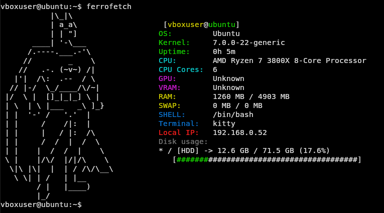

# ferrofetch
Neofetch alternative written in Rust.


**Why ferrofetch?**  
Ferro means iron in Latin, iron gets rusty — and the project is written in Rust ;)

---

## Features

- System user and hostname
- OS name
- Kernel
- System uptime
- CPU name
- CPU Cores
- CPU usage
- GPU name
- VRAM
- GPU usage
- RAM (used/total)
- SWAP (used/total)
- local IP Adress
- Disk Usage with bar
- ASCII banners
- Adjustable color and different banners with cli arguments
- select banner directly from path in .txt file
- Persistent configuration via `config.toml`
- no_ascii flag just to show the system information without a banner

---

## Screenshot



---

## Installation
1. clone the repo
```bash
git clone https://github.com/Kiwilus/ferrofetch.git
```
2. change into the project directory
```bash
cd ferrofetch
```
3. and install the tool
```bash
cargo install --path .
```
4. then execute with:
```bash
ferrofetch
```
## Quick start

### By default ferrofetch uses the ```batman``` banner in ```white``` color.

### you can set the color and the banner when executing ```ferrofetch --banner your_banner_of_choice --color your_color_of_choice```

### or with a custom banner: ```ferrofetch --banner_path path_to_your_ascii_banner.txt```

### or without a banner: ```ferrofetch --no-ascii```

---

## built in banners and colors
- ### built in banners:
- batman(default):
```
          .  .
          |\_|\
          | a_a\
          | | "]
      ____| '-\___
     /.----.___.-'\
    //        _    \
   //   .-. (~v~) /|
  |'|  /\:  .--  / \
 // |-/  \_/____/\/~|
|/  \ |  []_|_|_] \ |
| \  | \ |___   _\ ]_}
| |  '-' /   '.'  |
| |     /    /|:  | 
| |     |   / |:  /\
| |     /  /  |  /  \
| |    |  /  /  |    \
\ |    |/\/  |/|/\    \
 \|\ |\|  |  | / /\/\__\
  \ \| | /   | |__
       / |   |____)
       |_/

```
- dog:
```
       / \\__
      (    @\\___
      /         O
     /   (_____/
    /_____/   U
```
- cat:
```
⠠⢀⠢⣁⠒⡄⡸⠀⠀⠀⠀⠀⠀⠀⠀⠀⠀⠀⠀⠀⠀⠀⠀⠀⠀⠀⠀⠀⠀⠀⠀⠀⠀⠀⠀⠀⠀⠀⠀⠀⠀⠀⠀⠀⠀⠀⠀⠀⠀⠀⠀⠀⠀
⠂⠄⠣⢄⠣⠀⢇⠀⠀⠀⠀⠀⠀⠀⠀⠀⠀⠀⠀⠀⠀⠀⠀⠀⠀⠀⠀⠀⠀⠀⠀⠀⠀⠀⠀⠀⠀⠀⠀⠀⠀⠀⠀⠀⠀⠀⠀⠀⠀⠀⠀⠀⠀
⠀⠌⡱⢈⠆⣱⢹⠀⠀⠀⠀⠀⠀⠀⠀⠀⠀⠀⠀⠀⢀⡀⠀⠀⠀⠀⠀⠀⠀⠀⠀⠀⠀⠀⠀⠀⠀⠀⠀⠀⠀⠀⠀⠀⠀⠀⠀⠀⠀⠀⠀⠀⠀
⡠⢂⠱⡈⠔⡨⠸⠀⠀⠀⠀⠀⠀⠀⠀⠀⠀⠀⢀⢴⠟⠁⠀⢮⡢⠀⠀⠀⠀⠀⠀⠀⠀⢀⢀⣠⡄⢀⠀⠀⠀⠀⠀⠀⠀⠀⠀⠀⠀⠀⠀⠀⠀
⢀⠠⢃⠜⡠⢡⡀⡄⠀⠀⠀⠀⠀⠀⠀⠀⠀⣐⡟⠁⠀⠀⠀⠀⠳⡁⠀⠀⠀⠀⠀⣠⣾⠟⠁⠀⠀⢢⠀⠀⠀⠀⠀⠀⠀⠀⠀⠀⠀⠀⠀⠀⠀
⠀⡀⢃⠜⡰⠡⠄⢱⠀⠀⠀⠀⠀⠀⠀⠀⠀⡼⠀⠀⠀⠀⠀⠀⣀⢳⠃⠀⠀⢀⣴⠟⠁⠀⠀⠀⠀⠈⢇⠆⠀⠀⠀⠀⠀⠀⠀⠀⠀⠀⠀⠀⠀
⠀⣆⠁⢎⠰⡁⠎⢈⠀⠀⠀⠀⠀⠀⠀⠀⢸⠇⠀⠀⠀⠀⠀⣧⠈⠻⣅⢀⠠⡾⠁⠀⠀⠀⠀⠀⠀⠀⢸⠠⠀⠀⠀⠀⠀⠀⠀⠀⠀⠀⠀⠀⠀
⠀⢐⠨⢄⠣⡘⢄⢰⠀⠀⠀⠀⠀⠀⠀⠀⢸⠀⠀⠀⠀⠀⠀⢸⠀⠀⠈⠀⠰⠁⠀⠀⠀⠀⠀⠀⠀⠀⠈⣿⠀⠀⠀⠀⠀⠀⠀⠀⠀⠀⠀⠀⠀
⠀⠈⢀⠆⡡⡘⡘⠈⠀⠀⠀⠀⠀⠀⠀⠀⢸⠀⠀⠀⠀⠶⣉⠉⠀⠀⠀⠀⠀⠀⠀⠀⠀⠀⠀⠀⠀⠀⠀⣿⠀⠀⠀⠀⠀⠀⠀⠀⠀⠀⠀⠀⠀
⠀⠀⠨⢐⣡⣧⣵⡐⠀⠀⠀⠀⠀⠀⠀⠀⢸⡆⠀⠀⠀⠀⠉⠀⠀⠀⠀⠀⠀⠀⠀⠀⠀⠀⠀⠀⠀⠀⠀⣿⠀⠀⠀⠀⠀⠀⠀⠀⠀⠀⠀⠀⠀
⠀⠀⠐⣾⠃⠸⡆⠈⠙⠚⠦⣄⣀⢀⠀⠀⢘⢇⡤⠤⠄⠀⡴⢲⣦⠀⠀⢀⡴⢢⣤⡀⠀⠀⠀⢀⣀⡀⢰⠻⠀⠀⠀⠀⠀⠀⠀⠀⠀⠀⠀⠀⠀
⠀⠀⠸⡇⠀⢸⠆⠀⠀⠀⠀⠀⠈⠑⠲⠤⣂⡚⡇⠀⠀⡞⠀⣿⡧⠀⠀⠚⠀⢻⣿⣷⡀⠈⠉⠈⢀⣷⡓⠁⠀⠀⠀⠀⠀⠀⠀⠀⠀⠀⠀⠀⠀
⠀⠀⠗⣇⠀⣼⠀⠀⠀⠀⠀⠀⠀⠀⠀⠀⠀⠉⠙⠒⠢⠧⣄⡉⠁⠒⠂⠀⠀⠈⠿⢏⠁⡄⠀⣠⠾⠀⠀⠀⠀⠀⠀⠀⠀⠀⠀⠀⠀⠀⠀⠀⠀
⠀⠀⠈⠜⠶⠧⠤⠤⠤⠤⠤⠤⠤⠤⠤⠤⠀⠀⣀⣀⣀⣀⣀⣉⣉⡶⠤⠆⠀⠀⠘⠀⠀⠀⠐⣝⠆⠀⠀⠀⠀⠀⠀⠀⠀⠀⠀⠀⠀⠀⠀⠀⠀
⠀⠀⠀⠀⠀⠁⠁⠀⠀⠈⠀⠉⠉⠀⠈⠀⠀⠀⠉⠋⢒⠂⡀⠀⠀⠀⠀⠀⠀⠀⠀⠀⢀⣀⣀⡈⢖⠀⠀⠀⠀⠀⠀⠀⠀⠀⠀⠀⠀⠀⠀⠀⠀
⠀⠀⠀⠀⠀⠀⠀⠀⠀⠀⠀⠀⠀⠀⠀⠀⠀⠀⠀⠠⡺⠋⠁⠀⠀⠀⠀⠀⠀⠀⠀⠀⠘⢶⡢⠆⠁⣀⣠⣀⣀⠀⠀⠀⠀⠀⠀⠀⠀⠀⠀⠀⠀
⠀⠀⠀⠀⠀⠀⠀⠀⠀⠀⠀⠀⠀⠀⠀⠀⠀⡶⠒⠲⠁⠀⠀⠀⠀⠀⠀⠀⠀⠀⠀⠀⠀⠀⠈⠘⠫⣅⠀⠀⠈⠳⡕⠀⠀⠀⠀⠀⠀⠀⠀⠀⠀
⠀⠀⠀⠀⠀⠀⠀⠀⠀⠀⠀⠀⠀⠀⠀⠀⠀⢱⠀⠀⠀⠀⠀⠀⠀⠀⠀⠀⠀⠀⠀⠀⠀⠀⠀⠀⠀⠈⠳⡄⠀⠀⠈⠳⣅⢀⠀⠀⠀⢠⣴⠝⡴
⠀⠀⠀⠀⠀⠀⠀⠀⠀⠀⠀⠀⠀⠀⠀⠀⠀⠩⠣⠀⠀⠀⠀⠀⠀⠀⠀⠀⠀⠀⠓⠤⣀⠀⠀⠀⠀⠀⠀⢸⡀⠀⠀⠀⠀⠙⠒⠒⠚⠋⢡⢆⠃
⠀⠀⠀⠀⠀⠀⠀⠀⠀⠀⠀⠀⠀⠀⠀⠀⠀⢠⡞⠀⠀⠀⠀⠀⠀⠀⠀⠀⠀⠀⠀⢀⡞⠁⠀⠀⠀⠀⠀⣸⠁⠀⠀⠀⠀⠀⠀⠀⠀⠀⡾⠌⠀
⠀⠀⠀⠀⠀⠀⠀⠀⠀⠀⠀⠀⠀⠀⠀⠀⠀⠀⠒⡚⡄⠀⠀⠀⠀⠀⠀⠀⠀⠀⢀⠎⠀⠀⠀⠀⠀⠀⣰⠃⠀⠀⠀⠀⠀⠀⠀⠀⠀⡰⡃⠀⠀
⠀⠀⠀⠀⠀⠀⠀⠀⠀⠀⠀⠀⠀⠀⠀⠀⠀⠀⠀⠀⢡⠀⠀⠀⠀⠀⠀⠀⠀⠀⢸⠀⠀⠀⠀⠀⠀⠀⣇⠀⠀⠀⠀⠀⠀⠀⠀⢀⡼⠕⠀⠀⠀
⠀⠀⠀⠀⠀⠀⠀⠀⠀⠀⠀⠀⠀⠀⠀⠀⠀⠀⠀⠀⠊⢇⠀⠀⠀⠀⠀⠀⠀⠀⠘⣄⠀⠀⠀⠀⠀⠀⢸⠇⠀⠀⠀⠀⠀⣀⠤⡫⠊⠀⠀⠀⠀
⠀⠀⠀⠀⠀⠀⠀⠀⠀⠀⠀⠀⠀⠀⠀⠀⠀⠀⠀⠀⢀⣚⠆⠀⠀⠀⠀⠀⢆⠀⠀⠈⠳⢄⣀⣀⣀⣤⠻⠠⠗⠂⠖⠭⠟⠂⠁⠀⠀⠀⠀⠀⠀
⠀⠀⠀⠀⠀⠀⠀⠀⠀⠀⠀⠀⠀⠀⠀⠀⠀⠀⠀⡿⠋⠁⠀⠀⠀⠀⠀⠀⠈⢦⡀⠀⠀⠀⠀⠀⢸⠨⠀⠀⠀⠀⠀⠀⠀⠀⠀⠀⠀⠀⠀⠀⠀
⠀⠀⠀⠀⠀⠀⠀⠀⠀⠀⠀⠀⠀⠀⠀⠀⠀⠀⠑⠣⣄⣀⣀⣀⣀⣠⠤⢠⡴⠧⢣⠀⠀⠀⠀⠀⠈⡇⡄⠀⠀⠀⠀⠀⠀⠀⠀⠀⠀⠀⠀⠀⠀
⠀⠀⠀⠀⠀⠀⠀⠀⠀⠀⠀⠀⠀⠀⠀⠀⠀⠀⠀⠀⠀⠁⠀⠀⠀⠈⠀⠀⠀⠀⠈⡦⠀⠀⠀⠀⠀⢁⠀⠀⠀⠀⠀⠀⠀⠀⠀⠀⠀⠀⠀⠀⠀
⠀⠀⠀⠀⠀⠀⠀⠀⠀⠀⠀⠀⠀⠀⠀⠀⠀⠀⠀⠀⠀⠀⠀⠀⠀⠀⠀⠀⠀⠀⠠⣧⡀⠀⠀⠀⠀⡸⠀⠀⠀⠀⠀⠀⠀⠀⠀⠀⠀⠀⠀⠀⠀
⠀⠀⠀⠀⠀⠀⠀⠀⠀⠀⠀⠀⠀⠀⠀⠀⠀⠀⠀⠀⠀⠀⠀⠀⠀⠀⠀⠀⠀⠀⠀⠀⠹⠒⠤⠤⠼⠑⠁⠀⠀⠀⠀⠀⠀⠀⠀⠀⠀⠀⠀⠀⠀
```
## Persistent Configuration via config.toml

You can now set your preferred banner and color permanently using a config file.

create a ferrofetch configuration directory:

```
mkdir ~/.config/ferrofetch
```

and edit with your text file of choice the ```~/.config/ferrofetch/config.toml```

example config.toml:
```bash
# Default banner (can be: batman, cat or dog)
banner = "cat"

# Default color
color = "cyan"

# Optional: use a custom banner from a text file
banner_path = "/home/youruser/.config/ferrofetch/my_banner.txt" # please use '/home/youruser' and not '~/'

# and you can deactivate the banner and just display ypur system information
no_ascii = true
```

---


### Available colors

- red
- green
- yellow
- blue
- magenta
- cyan
- white
- black


---

## Roadmap

### Planned features

- Multiple config profiles
- Desktop Envoirment/Window manager
- cross-platform support
- Eradicate all unwrap() and expect() calls by introducing nead error handling

### Done things

- Shell + Terminal
- when banner_path set in config.toml, you cant execute 'ferrofetch --banner batman' the banner_path will ovverride it and you are forced to edit the config.toml 
- CPU/GPU usage
- --no_ascii flag (Just show the system Info)
- remove the Ok() in the IP adress function
- When no gpu found do no panic just dont show it
- GPU VRAM, CPU Cores, SWAP memory
- better get_gpu function without SHELL usage (not linux only)
- configuration via .toml file where you can set color/banner manually and forever
- Argument parsing with clap and other ASCII banners
- Argument parsing with clap for the color of the banner
- this structure: user@hostname, OS, Kernel, Uptime, CPU name, GPU, RAM (used/total), local IP adress, Disk usage
- select ASCII banner directly with path to file
